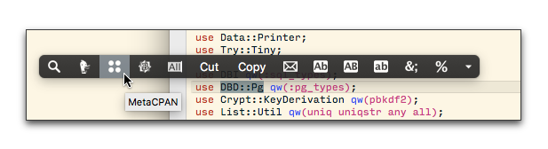

# popclip-metacpan

##PopClip extension to search metacpan.org for selected text in front window

Install this [PopClip](http://pilotmoon.com/popclip/) extension to use the selected text as the search string for [MetaCPAN](https://metacpan.org).

The extension uses a simple regex to determine whether the PopClip action should be included for the selected text.

- `(?s)^\s*[\w:]{1,200}\s*$`

See the [PopClip User Guide](http://docs.pilotmoon.com/article/24-popclip-user-guide) for details on installing PopClip extensions. 
